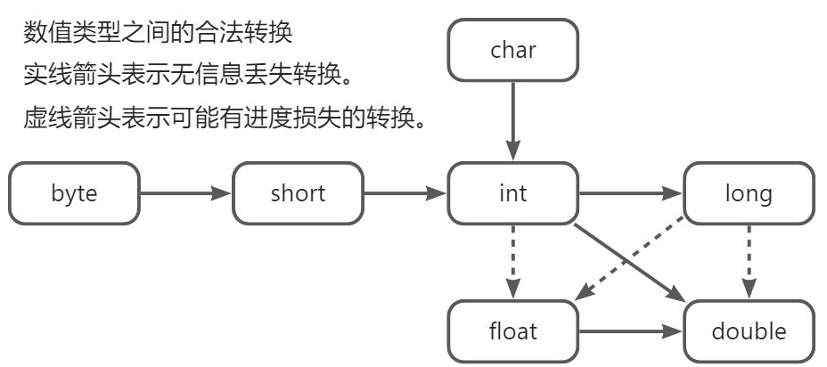

# 2·Java语言元素

- [2·Java语言元素](#2java语言元素)
  - [关键字](#关键字)
  - [注释](#注释)
  - [运算符](#运算符)
    - [算数运算符](#算数运算符)
    - [关系运算符](#关系运算符)
    - [逻辑运算符](#逻辑运算符)
    - [位运算符](#位运算符)
    - [自增自减](#自增自减)
    - [三元运算符](#三元运算符)
  - [变量](#变量)
    - [常量](#常量)
  - [流程控制](#流程控制)
    - [选择结构](#选择结构)
      - [if...else](#ifelse)
      - [switch...case](#switchcase)
    - [循环结构](#循环结构)
      - [for](#for)
      - [增强for](#增强for)
      - [forEach](#foreach)
      - [迭代器（Iterator）](#迭代器iterator)
      - [while](#while)
      - [do](#do)
      - [结束流程](#结束流程)
  - [输入输出](#输入输出)
    - [Scanner](#scanner)
    - [输出](#输出)
  - [枚举](#枚举)
  - [基本数据类型](#基本数据类型)
    - [整型](#整型)
    - [进制标记](#进制标记)
    - [浮点类型](#浮点类型)
      - [浮点数值计算](#浮点数值计算)
    - [类型转换](#类型转换)
      - [数值计算过程](#数值计算过程)
      - [浮点数值转换](#浮点数值转换)
    - [char类型](#char类型)
      - [Unicode](#unicode)
    - [boolean类型](#boolean类型)
  - [方法](#方法)
    - [构造方法](#构造方法)
    - [方法定义](#方法定义)
    - [方法调用](#方法调用)
    - [方法重写](#方法重写)
    - [方法重载](#方法重载)
    - [可变参数](#可变参数)
    - [递归](#递归)


## 关键字
Java中有51个关键字和2个保留字，关键字不能用于命名（变量、对象）。

| **保留字** |  |
| --- | --- |
| goto | 不允许使用 |
| const | 不允许使用 |
| **访问修饰符** |  |
| public | 公共的，在任何地方可引用 |
| private | 私有的，在本类中可引用 |
| protected | 受保护的，在本包或子类中可引用 |
| default | 默认的，在本包中可引用 |
| **定义类、接口、抽象类、实现、继承、枚举** |  |
| class | 定义一个类 |
| interface | 定义一个接口 |
| abstract | 修饰类为抽象类 |
| implement | 声明类实现的接口 |
| extends | 声明类继承的类 |
| enum | 定义一个枚举类 |
| new | 创建一个对象 |
| super | 调用父类方法、变量 |
| this | 调用本类方法、变量 |
| **包** |  |
| package | 声明包路径 |
| import | 引入包 |
| **数据类型** |  |
| byte | 字节型，8bit |
| char | 字符型，16bit |
| boolean | 布尔类型 |
| short | 短整型，16bit |
| int | 整型，32bit |
| float | 浮点型，32bit |
| long | 长整型，64bit |
| double | 双精度浮点型，64bit |
| void | 修饰方法无返回值 |
| null | 对象没有值则为null |
| true | 真 |
| false | 假 |
| **流程控制** |  |
| if、else | 选择结构 |
| switch、case | 选择结构 |
| do、while | 循环结构 |
| for | 循环结构 |
| continue | 结束本次循环，开始下次循环 |
| break | 跳出循环 |
| return | 结束当前方法并返回 |
| **运算符** |  |
| instanceof | 判断左边的对象是否是右边对象的实例，返回布尔类型 |
| **静态、本地、最终** |  |
| static | 修饰类、方法、变量为静态。单独使用为静态区 |
| final | 修饰类、方法、变量为最终的。类不可被继承、方法不可被重写、变量不可变（常量） |
| native | 修饰方法为本地方法 |
| **线程** |  |
| synchronized | 修饰方法，线程同步，使线程在某个方法中同步执行 |
| volatile | 修饰变量、方法，线程同步，可以保证有序性。 |
| **异常** |  |
| try | 尝试在try块中的异常捕捉 |
| catch | 处理异常 |
| finally | 异常处理块中的最终执行，始终会被执行 |
| throw | 不处理异常，向上抛出异常 |
| throws | 声明方法可能抛出的异常 |
| assert | 断言 |
| **其他** |  |
| transient | 修饰变量，在实现Serilizable接口，不被序列化 |
| strictfp | 修饰类、接口、方法。关键字声明范围内所有浮点运算都是精确的，符合IEEE-754规范的。 |

## 注释
代码注释是程序代码可维护性的重要环节之一。 在编译后不会出现在可执行程序中。

- 必须加的基本注释：**类，接口，构造函数，方法，全局变量，属性。**
- 必须加的特殊注释：**算法，代码不明晰，代码修改处，循环与选择分支嵌套，向外提供的接口。**
```java
/**
 * 这是文档注释, 描述这个方法的一切.
 * 文档注释规则：
 * 1、使用统一的标点
 * 2、内容简单明了、含义准确、内容不大于10个字
 * 3、必须加的基本注释：类，接口，构造函数，方法，全局变量，属性。
 * 4、必须加的特殊注释：算法，代码不明晰，代码修改处，循环与选择分支嵌套，向外提供的接口。
 * 5、getter/setter不需加注释
 * @author lingy
 * @version 1.0
 * @param 无参数
 * @return 无返回值
 * @exception 可能抛出的异常
 * @see 参考的对象
 * */
public void annotationTest() {
    // 这是单行注释, 描述变量意义、逻辑
    int age = 18;

    /*
    * 这是多行注释
    * 描述一段代码、逻辑、或者备注
    * */

    // TODO 特殊标记, 备注此处未完成
    // XXX 特殊标记, 此处代码有待商榷、改进
    // FIXME 特殊标记, 此处代码待修复
}
```
文档注释中可以加入标记说明，标记是插入文档注释中的特殊标记，它们用于标识代码中的特殊引用。javadoc 标记由“@”及其后所跟的标记类型和专用注释引用组成。

| 标记 | 简述 |
| --- | --- |
| @author | 标记类，表示作者名 |
| @version | 标记类、方法，表示版本号 |
| @param | 标记方法，表示方法入参 |
| @return | 标记方法，表示方法返回值 |
| @exception | 标记方法，表示方法可能抛出的异常 |
| @see | 标记类、方法，表示参考转向 |

## 运算符
运算符用于连接值，Java提供了一组丰富的算数和逻辑运算符以及数学函数。使用括号可以控制运算符优先级，括号中的运算最优先。不使用括号时就按照运算符优先级次序进行计算。

### 算数运算符
| + | 加法 |
| --- | --- |
| - | 减法 |
| * | 乘法 |
| / | 除法 |
| % | 取模，左操作数除以右操作数的余数 |

- 整数被0除将会产生一个异常，浮点数被0除将会得到无穷大或NaN结果。
- 结合赋值：`x += 4;`等价于`x = x + 4;`

### 关系运算符
| **关系运算符（返回boolean类型）** |  |
| --- | --- |
| == | 检测相等性 |
| != | 检测不相等 |
| > | 大于 |
| < | 小于 |
| >= | 大于等于 |
| <= | 小于等于 |

- `&&`和`||`运算按照短路方式求值：如果第一个操作数已经能够确定表达式的值，则不计算第二个操作数。
- 比较对象类型的内容要使用`equals()`方法，如与常量比较时，使用常量来调用方法避免NPE。

### 逻辑运算符
| **逻辑运算符（参数为boolean，返回boolean类型）** |  |
| --- | --- |
| && | 逻辑与，当两个参数都为真，条件为真。 |
|  &#124;&#124; | 逻辑或，当任一参数为真，条件为真。 |
| ！ | 逻辑非，反转参数的逻辑状态。 |

### 位运算符
| **位运算** |  |
| --- | --- |
| & | 与。如果相对应位都是1，则结果为1，否则为0 |
| &#124; | 或。如果相对应位都是 0，则结果为 0，否则为1 |
| ^ | 异或。如果相对应位值相同，则结果为0，否则为1 |
| ~ | 取反。翻转操作数的每一位，即0变成1，1变成0 |
| << | 左移。二进制各位全部左移若干位，高位丢弃，低位补0 |
| >> | 右移。二进制各位全部右移若干位，高位补0 |
| >>> | 按位右移补零操作符。左操作数的值按右操作数指定的位数右移，移动得到的空位以0填充。 |

- 不存在`<<<`运算符。
- 计算机中进行`+-*/`运算都是转换为二进制运算，合理的运用位运算可以加快程序运行速度。
- 对一个数进行`~`运算，再进行&运算，可以找到二进制数中最右的数值为1的位置。
- 对一个数使用`<<1`，相当于操作数 `*2`
- 对一个数使用`>>1`，相当于操作数`/2`

### 自增自减
| ++ | 自增，操作数加一 |
| --- | --- |
| -- | 自减，操作数减一 |

运算符只能用于变量，不能用于常量。
运算符实际有两种形式：前缀形式`++n`、后缀形式`n++`。都会使变量加一或减一，但用在表达式中时，前缀形式会先完成加1，而后缀形式会使用变量原先的值。

- **建议不要在表达式中使用自增自减运算符，这样的代码容易造成困惑，带来烦人的bug。**

### 三元运算符
| ? | `?`：`x < y ? x : y;`。
如表达式为`true`，返回`x`，否则返回`y`。 |
| --- | --- |

## 变量
定义变量：由于Java是强类型语言，每个变量在声明定义时必须指定数据类型。从JDK10开始，对于局部变量，如果可以从变量的初始值推断出它的类型，就不再需要声明类型，可以使用关键字`var`而无须指定类型。
变量命名：标识符以字母、数字、下划线、美元符号组成，数字不能开头。不能与关键字同名。变量名大小写敏感，长度基本没有限制。

---

- 声明一个变量后，必须对变量赋值将其显式初始化，**不建议使用未初始化的变量。**
- 在Java中，变量的声明可以放在任何地方，但要尽可能靠近第一次使用的地方，保持良好的编码风格。

### 常量
使用`final`关键字修饰一个变量就可以使其不可变，即为 常量。
常量在声明时就必须赋值，赋值后不可更改，命名建议**全大写并以下划线隔开**。

## 流程控制
程序的执行顺序是从上到下的，即顺序结构，通过流程控制还有选择结构和循环结构。

### 选择结构
选择结构指在满足（或不满足）某个条件时，执行（或不执行）某段代码。

#### if...else
```java
boolean flag = true; 

if (flag) {
    // 如果flag为真则执行此块
} else if (1 == 2) {
    // 当以上条件不满足时且当前表达式为真时执行此块
} else {
    // 当以上条件都不满足时执行此块
}
```

- `if`可以单独使用，也可以搭配`else if`和`else`使用。
- `else if`必须跟在`if`后，且可有多个`else if`。
- `else`必须跟在`if`或`else if`后，只能有一个。

#### switch...case
```java
int age = 18;

switch (age) {
	case 16 :
        // 当age为16时执行此块
    	// 如果不使用break或continue 则会继续执行下去
    case 17 :
        // 当age为17时执行此块
        // 如果不使用break或continue 则会继续执行下去
    case 18 :
        // 当age为17时执行此块
    default :
        // 当没有被break或没有满足任何条件时 到达判断时默认会执行此块
}
```

- 不要忘记`break`。

### 循环结构
循环结构指满足条件时，反复执行某段代码的行为。

#### for
在已知循环次数时使用。
`for`的三段表达式作用分别是：【初始化变量】; 【布尔表达式】; 【更新变量】。
```java
for(int i = 0; i < 9; i++){
    // 在满足布尔表达式时执行此块
}
```

#### 增强for
快速遍历数组，是迭代器的语法糖。
```java
// 增强for
String[] arr = new String[] {"a", "b", "c", "d"};
for (String cur : arr) {
    // 遍历数组每个元素执行此块
}
```

#### forEach
List集合的方法，实现快速遍历，可以搭配Lombda表达式使用。
当在`foeEach`中删除当前对象的元素时会发生NPE，原因是其使用下标获取元素，如必须在循环中删除元素，可以使用迭代器`Iterator`。
```java
String[] arr = new String[] {"a", "b", "c", "d"};
List<String> list = Arrays.stream(arr).collect(Collectors.toList());
list.forEach(System.out::println);
```

#### 迭代器（Iterator）
使用迭代器在循环集合的同时删除元素。
```java
String[] arr = new String[] {"a", "b", "c", "d"};
List<String> list = Arrays.stream(arr).collect(Collectors.toList());
// 获取集合的迭代器
Iterator<String> it = list.iterator();
while (it.hasNext()) {
    System.out.println(it.next());
    // 删除元素
    it.remove();
}
// 此时list已经为空
list.forEach(System.out::println);
```

#### while
常用在不能明确循环次数时。
```java
while(【布尔表达式】){
    // 当布尔表达式为真时执行此块
}
```

#### do
`do`关键字后必须跟`while`循环，作用是先执行一次循环再判断是否继续循环，使循环至少执行一次。
```java
do {
    // 循环块,先执行一次再判断
} while(【布尔表达式】);
```

#### 结束流程
- `continue`：结束当次循环，开始下一轮循环
- `break`：跳出当前循环块或`switch`块。

## 输入输出

### Scanner
可以通过java.util.Scanner类来获取用户的输入。
构造方法需要传入输入设备，`Scanner in = new Scanner(System.in);`
标准输入流：`System.in：InputStream`

| Scanner() | 构造方法 |
| --- | --- |
| nextLine() | 读取一行 |
| next() | 读取一个单词 |
| nextInt() | 读取一个整数 |
| nextDouble() | 读取一个浮点数 |
| hasNext() | 是否还有输入 |

### 输出
使用java.lang.System类输出到控制台。
标准输出流：`System.out：PrintStream`
标准错误输出流：`System.err：``PrintStream`
```java
public void printTest() {
    System.out.println("标准输出流");
    System.err.println("标准错误输出流");
    System.out.print("比第一种方式少一个换行 \n");
    System.out.printf("格式化字符串%s", "填充 \n");
}

// console
// 标准输出流
// 标准错误输出流   (这行是红色的)
// 比第一种方式少一个换行,也可以换行
// 格式化字符串填充
```
## 枚举
枚举是一个特殊的类，一般表示一组常量，当可以列出某些有穷序列集的所有成员时，可以定义枚举类标记。

使用关键字`enum`替代`class`定义一个枚举类，其中每个枚举值都是`public static final`的。
实际使用中常通过属性和构造方法为枚举值设置属性，并提供get方法。
```java
public enum ColorEnum {
    /**红色*/
    RED("red", "红色"),
    /**蓝色*/
    BLUE("blue", "蓝色"),
    /**绿色*/
    GREEN("green", "绿色"),
    ;

    private String code;
    private String desc;

    public String getCode() {return code;}

    public void setCode(String code) {this.code = code;}

    public String getDesc() {return desc;}

    public void setDesc(String desc) {this.desc = desc;}

    public static String getDesc(String code) {
        if (Objects.isNull(code) || code.isEmpty()) {
            return null;
        }
        for (ColorEnum ele : ColorEnum.values()) {
            if (ele.code.equals(code)) {
                return ele.getDesc();
            }
        }
        return null;
    }

    ColorEnum(String code, String desc) {
        this.code = code;
        this.desc = desc;
    }
}
```

## 基本数据类型
Java中有8大基本数据类型（整型、浮点型、字符型、布尔型）及其包装类、容器类等。

### 整型
Java提供4种整型，用于表示没有小数部分的数值，允许是负数。

| 类型 | 大小（bit/字节） | 取值范围 |
| --- | --- | --- |
| long | 8 | -9223372036854775828~9223372036854775827 |
| int | 4 | -2147483648~2147483647 |
| short | 2 | -32768~32767 |
| byte | 1 | -128~127 |

- 长整型数值有一个后缀`L`或`l`
- 从JDK7开始，可以为数字字面量加下划线（1_000_000表示100万），这些下划线为了更易读，编译器会去除这些下划线。

### 进制标记
从JDK7开始，可以加上前缀标记不同的进制。
`0b`或`0B`标记二进制数（如0b1001对应十进制中的9）
`0x`或`0X`标记十六进制数（如0xCAFE）
`0`标记八进制数（如010对应十进制中的8），**八进制显然很容易混淆，尽量不要使用八进制常数。**

### 浮点类型
Java提供了2种浮点类型，用于表示有小数部分的数值。

| 类型 | 大小（bit/字节） | 取值范围 |
| --- | --- | --- |
| double | 8字节 | 大约+-1.79769313486231570E+308（有效位数为15位） |
| float | 4字节 | 大约+-3.40282347E+38F（有效位数为6~7位） |

- float的有效位置为6~7位，导致很多情况下不能满足需求。
- double表示的数值精度是float类型的两倍（双精度数值）
- float类型的数值有一个后缀F或者f（如3.14F），没有后缀F的浮点数值（如3.14）默认为double类型。
- double类型的数值的后缀D或者d可以省略。

#### 浮点数值计算
所有的浮点数值计算都遵循IEEE754规范。**浮点类型应避免进行比较。**
表示溢出和出错情况的特殊的浮点数值：正无穷大（一个正整数除以0）、负无穷大、NaN（计算0/0或者负数的平方根）。


浮点数值不适用于无法接受舍入误差的金融计算（如2.0-1.1=0.8999999999999999）。如果在数值计算中不允许有任何舍入误差，就应该使用BigDecimal类。
这种误差是由于浮点数值采用二进制表示，二进制种无法精准地表示分数1/10，就好像十进制中无法精准地表示分数1/3一样。

### 类型转换
类型转换指将一种数据类型转换为另一种数据类型。
低精度到高精度数据类型自动转换。
高精度到低精度需要强制转换，丢失部分精度。语法：`【类型】 【变量名】`
数据类型的精度从低到高为：byte，short，char，int，long，float，double
**布尔类型不能进行转换。**



#### 数值计算过程
当用一个二元运算符连接两个值时（如n+f，n是整数，f是浮点数），先要将两个操作数转换为同一种类型，然后进行计算。

- 如果两个操作数种有一个是double类型，另一个操作数就会转换为double类型。
- 否则，如果其中一个操作数为float类型，另一个操作数将会转换为float类型。
- 否则，如果其中一个操作数为long类型，另一个操作数将会转换为long类型。
- 否则，两个操作数都将被转换为int类型。

#### 浮点数值转换
将double类型转换为int类型。在Java中允许进行这种数值之间的类型转换，但可能会丢失一些信息。

一个大整数所包含的位数比float类型能够表示的位数多，当转换为float类型时会损失一些精度。
```java
int n = 123456789;
float f = n;//f  = 1.23456792E8
```

将浮点数转换为整型，通过截断小数部分。
```java
double x = 9.997;
int nx = (int) x; // nx的值为9
```

如果想对浮点数进行舍入运算，得到最接近的整数，需要使用Math.round方法，调用round方法后返回的结果为long类型，仍要使用强制类型转换。
```java
double x = 9.997;
int nx = (int) Math.round(x);
```

如果类型转换时，超出了目标类型的表示范围，结果就会截断成一个完全不同的值。
`(byte) 300` 实际值为`44`

### char类型
char类型原本用于表示单个字符。如今，有些Unicode字符可以用一个char值描述，另外一些则需要两个char值。
char类型的字面值要用单引号括起来（如'A'是编码值为65的字符常量，这与"A"不同，"A"是包含一个字符A的字符串）
char类型的值可以表示为十六进制值，范围从\u0000~\uFFFF
\u2122表示商标符号（TM）
\u03C0表示希腊字母（Π）

| 转移序列 | 名称 | Unicode值 |
| --- | --- | --- |
| \\b | 退格 | \\u0008 |
| \\t | 制表 | \\u0009 |
| \\n | 换行 | \\u000a |
| \\r | 回车 | \\u000b |
| \\" | 双引号 | \\u0022 |
| \\' | 单引号 | \\u0027 |
| \\\\ | 反斜杠 | \\u005c |

#### Unicode
Unicode打破了传统字符编码机制的限制。在Unicode出现前，就有许多不同的标准（美国的ASCII，西欧的ISO8859-1，俄罗斯的KOI-8，中国的GB-18030和BIG-5等），这导致在不同的编码方案下可能对应不同的字母。Unicode启动了统一工作。
在Java中，char类型描述了UTF-16编码中的一个代码单元。**强烈建议不要在程序中使用char类型**，除非确实需要处理UTF-16代码单元，最好将字符串作为抽象数据类型处理。

### boolean类型
boolean类型有两个值：false和true，用来判断逻辑条件。

## 方法
方法是Java语句的集合，在C++中称为函数。它是解决一类问题的代码块，定义在对象中。

### 构造方法
每个类都有的方法，用于创建当前对象的实例。在不显式声明时，默认拥有一个无参构造方法。
构造方法没有返回值，且方法名必须和类名一致。
**每个实例的创建都要经过构造方法，可能利用这个特性初始化一些值。**

### 方法定义
方法定义在类中，包含一个方法头和一个方法体。
```java
// 方法头：
// public 访问修饰符
// String 返回值类型
// getHelloWorld 方法名
// (String name) 形式参数据类型 参数名
// throws RuntimeException 声明方法可能抛出的异常
public String getHelloWorld(String name) throws RuntimeException {
    // 方法体, 具体的执行语句
    String str = "Hello World for " + name;
    // 返回数据
    return str;
}
```
访问修饰符包括（范围从大到小）：

- public：方法可在任何地方被调用。
- protected：方法可在本包及子类中被调用。
- default：方法可在本包中被调用。
- private：方法仅可在本类中被调用。

---

- 形式参数：方法被调用时用于接收外界输入的数据。
- 实际参数：调用方法时实际传给方法的数据。

### 方法调用
在本类中可以直接以方法名调用；在其他对象中需要创建一个对象的实例，在满足访问范围的条件下，通过实例调用方法。
静态方法中不能调用非静态方法，因为静态区会优先加载，此时非静态方法还未加载。
静态方法可以直接通过对象调用，不需要创建一个对象的实例。

### 方法重写
方法重写是指子类继承父类后，对其方法进行重写，是实现多态的一种方式。

重写的规则：
1. 方法名相同。
2. 形参列表相同。
3. 修饰符范围可以扩大但不能缩小。
4. 抛出的异常范围可以被缩小但不能扩大。 
5. 使用`@Override`注解标记。

### 方法重载
方法重载是指在一个类中，函数名称相同，但形参不同的函数。是实现多态的一种方式。
当方法名称相同时，编译器会根据调用方法的参数个数、类型等逐个匹配，选择对应的方法，匹配失败编译器会报错。

方法重载的规则：
1. 方法名称相同。
2. 参数列表不同（个数不同，数据类型不同，顺序不同）。
3. 返回值可以相同或不同（如果不同不足以称为方法重载）。

### 可变参数
从JDK1.5开始，Java支持传递同类型的可变参数给一个方法。有时不能确认将传递给方法的实参个数，那么就可以用到可变参数。

可变参数使用规则：
1. 在方法声明中，在指定参数类型后加一个省略号`...`
2. 一个方法中只能指定一个可变参数，它必须是方法的最后一个参数，任何普通的参数必须在它之前声明。
3. 可变参数在方法中是一个数组类型。

```java
/**
 * 打印最大的数
 * */
public static void printMax(Double... numbers) {
    if (numbers.length == 0) {
        System.out.println("No argument passed");
        return;
    }
    double result = numbers[0];
    for (int i = 1; i < numbers.length; i++) {
        result = result > numbers[i] ? result : numbers[i];
    }
    System.out.println("Max number is " + result);
}


public static void main(String[] args) {
    printMax(2.0, 3.9, 1.1, 0.99);
}
```

### 递归
递归是指方法在方法体中调用自己的行为，方法的调用是一种压栈的过程，通过递归可以找到局部最优解，可以用简单的方法解决一些复杂的问题。**但要注意的是当不确认方法的调用次数是否可控时，不建议使用递归，可能导致栈溢出溢出。**

```java
public static void main(String[] args) {
    System.out.println(getFactorial(5));
}

public static long getFactorial(int number) {
    if (number == 1) {
        return 1;
    }
    return number * getFactorial(number - 1);
}
```
